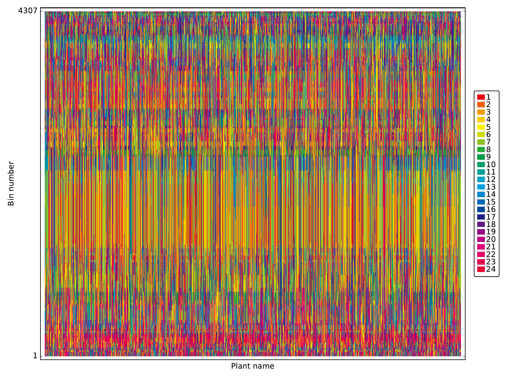

# binHeatmap
Draw the heatmap-like plot of IBD bins which calculated in many strain, each color indicates that is comes from a different source
```shell
python binHeatmap.py -h
-s: 每个bin中,各个品种的基因型来源(eg: data/merbin_IBD_allparent.txt)
-b: 每个bin信息(eg: data/mergbin_info_all.txt)
-l: 指定要显示的品种列表, 不设置就是显示data/merbin_IBD_allparent.txt中所有的品种
-c: 指定要显示的染色体, 不设置就显示所有的染色体信息
-i: 指定要显示的某一个区段信息, 格式为chrX:pos1-pos2(note: X是染色体号). 若-i和-c同时存在, -i优先
-o: 指定输出文件的目录, 不指定则默认为output
```

运行shell代码实例: 
```shell
python binHeatmap.py -s ../data/merbin_IBD_allparent.txt -b ../data/mergbin_info_all.txt -l ../data/name.list -o output
```

结果示意图:


